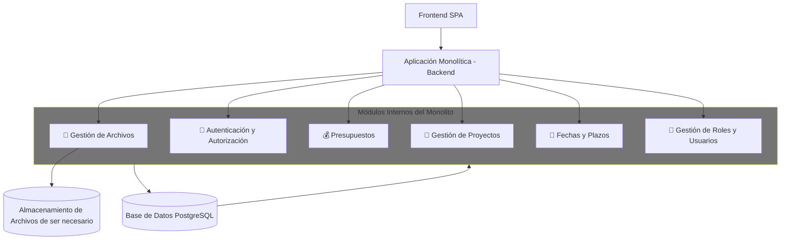

# 📌Resumen caso ProManage  – Plataforma de gestión administrativa
El presente documento describe el diseño arquitectónico propuesto, así como las decisiones clave en materia de escalabilidad, disponibilidad, seguridad y mantenimiento continuo. El objetivo es garantizar que la plataforma pueda crecer de forma sostenible, adaptarse a nuevas necesidades y ofrecer una experiencia fluida a todos sus usuarios.

La empresa **ProManage** con el objetivo de optimizar su desarrollo de una plataforma de gestión administrativa, ha conformado un equipo especializado en **DevOps**, que seran los encargado de diseñar una solución robusta, escalable y segura.

Esta plataforma permitirá a los usuarios:
# 📊 Módulos Funcionales

| Función                      | Descripción                                                                 |
|------------------------------|-----------------------------------------------------------------------------|
| 🔐 Autenticación y Autorización | - Registro, inicio de sesión y gestión de tokens seguros (JWT/OAuth2). - Control de acceso basado en roles (RBAC) para proteger rutas y acciones. |
| 📁 Gestión de Proyectos       | - Creación, edición y visualización de proyectos. |
| 💰 Presupuestos               | - Asignación y seguimiento de montos presupuestados por proyecto. - Historial de modificaciones y alertas ante sobrecostos. |
| 📎 Adjuntar Archivos y Documentos | - Carga, visualización y descarga de archivos (PDF, imágenes, Excel). |
| 📆 Fechas y Plazos de Entrega | - Definición de hitos, fechas límite y recordatorios automáticos. - Vista de calendario. |
| 👥 Perfiles y Roles de Usuario | - Niveles de acceso (admin, gestor, colaborador, cliente). - Pantallas y funcionalidades habilitadas según rol. |

---

## 📊 Diagrama en Mermaid

🧱 ¿Qué muestra el diagrama?
Es una arquitectura monolítica modular para ProManage, donde todo el backend está en una sola aplicación, pero dividido internamente en módulos.

🔹 Componentes principales
- Frontend SPA: Aplicación web que se comunica con el backend.
- Backend Monolítico: Una sola app que contiene todos los módulos:
- 📎 Gestión de Archivos
- 🔐 Autenticación y Autorización
- 💰 Presupuestos
- 📁 Gestión de Proyectos
- 📆 Fechas y Plazos
- 👥 Roles y Usuarios
- Base de Datos PostgreSQL: Compartida por todos los módulos.
- Almacenamiento en la nube: Usado solo por el módulo de archivos.

