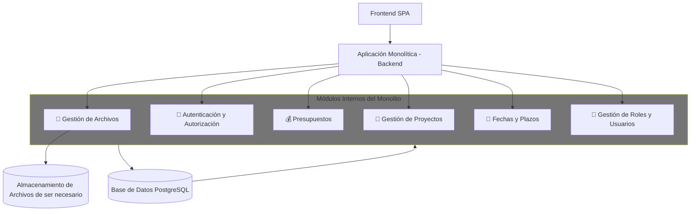

#  🧾Resumen caso ProManage  – Plataforma de gestión administrativa

**ProManage** es una plataforma de gestión administrativa diseñada para facilitar la planificación, organización y seguimiento de proyectos dentro de una organización. Con el objetivo de optimizar su desarrollo, la empresa ha conformado un equipo especializado en DevOps, encargado de diseñar una solución robusta, escalable y segura. La aplicación permitira registrar usuarios, crear proyectos, adjuntar archivos relevantes, asignar presupuestos y controlar fechas y roles de acceso, brindando así una herramienta integral para la gestión eficiente de proyectos.

## 🚀 Objetivos del Proyecto

- Simplificar la gestión de proyectos desde una única interfaz.
- Ofrecer control de acceso por roles.
- Almacenar archivos y documentos relacionados a cada proyecto.
- Notificar a los usuarios sobre eventos importantes.
- Facilitar la escalabilidad y el mantenimiento con buenas prácticas DevOps.

Esta plataforma permitirá a los usuarios:
## 🧩 Funcionalidades Principales

| Funcionalidad                               | Descripción                                                                 |
|---------------------------------------------|-----------------------------------------------------------------------------|
| 🔐 Registro y autenticación de usuarios     | Gestión de acceso con Supabase Auth.                                        |
| 📁 Gestión de proyectos                     | Permite crear, editar y visualizar proyectos.                               |
| 💰 Asignación de presupuestos               | Define y asigna presupuestos individualmente por proyecto.                  |
| 📎 Adjuntar archivos                        | Carga y vinculación de documentos relevantes vía Supabase Storage.          |
| 📆 Control de fechas y plazos               | Gestión de tiempos clave y fechas de entrega.                               |
| 👥 Roles y permisos                         | Configura distintos niveles de acceso para los usuarios.                    |
| ✉️ Notificaciones por correo                | Alertas automáticas enviadas vía Resend.                                    |

---

## 🧱 Arquitectura del Proyecto
| Componente                   | Descripción y Motivo de Uso                                             |
|------------------------------|-------------------------------------------------------------------------|
| **Arquitectura Monolítica** | Una arquitectura monolítica permite desarrollar y entregar una solución funcional más rápido, ideal para una fase inicial, Reduciendo complejidad técnica, con posibilidad de transición futura. |
| **Railway**            | Provee infraestructura como servicio (PaaS) con despliegues rápidos, escalabilidad automática y da visibilidad completa del estado de la aplicación|
| **Supabase**           | Solución BaaS que  permite centrarse en el negocio, no en reinventar el backend. Autenticación, base de datos relacional y almacenamiento de archivos ya vienen listos para usarse, y se integran perfectamente con una arquitectura monolítica.|
| **Resend**             | Permite el envío de notificaciones automáticas por correo de forma confiable y escalable. |
| **Docker**             | Garantiza portabilidad y consistencia en diferentes entornos gracias a la contenerización. |
| **Docker hub**         | Garantiza desplegar versiones consistentes en diferentes entornos de forma segura y eficienteportabilidad gracias a la contenerización. |
| **Kubernetes (futuro)** | Facilita la orquestación de contenedores en entornos complejos, ideal para escalar en fases avanzadas. |

---

## ⚙️ Tecnologías Utilizadas

| Categoría             | Tecnología               | Uso principal                                               |
|----------------------|--------------------------|-------------------------------------------------------------|
| **Infraestructura**  | Railway (PaaS)           | Despliegue y escalado automático                            |
|                      | Docker                   | Contenerización de la aplicación                            |
|                      | Docker Hub               | Gestión de registros de contenedores                        |
|                      | Kubernetes (futuro)      | Orquestación avanzada de contenedores                       |
| **Backend / BaaS**   | Supabase Auth            | Registro e inicio de sesión de usuarios                     |
|                      | Supabase PostgreSQL      | Base de datos relacional para entidades del sistema         |
|                      | Supabase Storage         | Gestión de archivos y documentos                            |
| **Notificaciones**   | Resend                   | Envío de correos electrónicos y alertas                     |
| **Control de código**| Git + GitHub             | Control de versiones y colaboración                         |

---

## 📊 Arquitectura monolítica modular para ProManage y ¿Por qué usar Arquitectura Monolítica?

**Una arquitectura monolítica** simplifica el inicio del proyecto y permite validar rápidamente funcionalidades sin la complejidad de servicios distribuidos.

### Ventajas clave de una arquitectura monolítica:

| Aspecto                          | Justificación                                                                                  |
|----------------------------------|-----------------------------------------------------------------------------------------------|
| **💡 Ideal para MVPs o primeras versiones** | Permite validar funcionalidades y recoger feedback de usuarios sin sobrecargar la arquitectura. |
| **🚀 Rapidez de desarrollo**     | Un solo proyecto, un solo repositorio y una sola base de código facilitan ciclos de desarrollo cortos. |
| **📦 Menor complejidad inicial** | No requiere separar servicios, gestionar múltiples entornos o manejar comunicaciones entre microservicios. |
| **🧪 Facilidad de pruebas e integración** | Las pruebas se ejecutan en un único entorno, sin dependencias distribuidas.                  |
| **⚙️ Despliegue unificado**      | Se puede construir y desplegar como una sola unidad usando Docker y Railway.                  |
| **💰 Ahorro de recursos**        | Menos  costos operativo: una sola app consume menos infraestructura y gestión que múltiples servicios. |

--- 
# Diagrama de Arquitectura monolítica modular para ProManage

🧱 ¿Qué muestra el diagrama?
Es una arquitectura monolítica modular para ProManage, donde todo el backend está en una sola aplicación, pero dividido internamente en módulos.

🔹 Componentes principales
- Frontend SPA: Aplicación web que se comunica con el backend.
- Backend Monolítico: Una sola app que contiene todos los módulos:
- 📎 Gestión de Archivos
- 🔐 Autenticación y Autorización
- 💰 Presupuestos
- 📁 Gestión de Proyectos
- 📆 Fechas y Plazos
- 👥 Roles y Usuarios
- Base de Datos PostgreSQL: Compartida por todos los módulos.
- Almacenamiento en la nube: Usado solo por el módulo de archivos.

### ¿Y qué pasa a futuro?
Aunque se eligió una arquitectura monolítica para comenzar, el diseño sigue principios de **modularidad interna**. Esto facilitará una **eventual migración a microservicios** si el crecimiento y la escalabilidad lo requieren más adelante.

> En resumen: **La arquitectura monolítica es una decisión estratégica para acelerar la construcción de la primera versión de
ProManage sin complejidad innecesaria**, manteniendo abierta la opción de escalar en el futuro.

---

## 🏗️ ¿Por qué usar Infraestructura PaaS y BaaS?
 
El proyecto **ProManage** combina dos modelos modernos **PaaS (Platform as a Service)** y **BaaS (Backend as a Service)**, que juntos permite lanzar soluciones más rápido, escalar sin complicaciones y reducir costos operativos. El resultado: menos tiempo en desarrollo, menos errores, y más valor entregado al cliente, desde el primer día.

### 🔧 PaaS (Platform as a Service) — Railway

Railway permite desplegar, escalar y monitorear la aplicación sin tener que gestionar servidores, redes o balanceadores de carga.

### Ventajas clave de usar Railway:

| Aspecto                           | Justificación                                                                                   |
|-----------------------------------|--------------------------------------------------------------------------------------------------|
| **🚀 Despliegue instantáneo**     | Permite hacer deploy de la aplicación en segundos directamente desde GitHub o Docker.           |
| **⚙️ Escalado automático**        | Detecta y ajusta automáticamente los recursos según la carga sin intervención manual.           |
| **🧩 Integración simple con Docker** | Compatible con contenedores Docker personalizados, ideal para arquitecturas contenerizadas.     |
| **🔍 Observabilidad integrada**   | Ofrece monitoreo en tiempo real de logs, consumo de recursos y errores.                         |
| **📦 Entorno por servicio**       | Cada servicio (web, worker, DB, etc.) puede tener su propio entorno aislado y escalable.        |
| **🔗 CI/CD simplificado**         | Integración directa con GitHub: cada push puede generar automáticamente un nuevo despliegue.    |
| **🧰 Entorno amigable para DevOps**| Ideal para flujos de trabajo modernos: soporte para variables de entorno, secrets y CLI.        |
| **💰 Modelo basado en uso real**  | Precios escalables según consumo (RAM, CPU y tiempo), evitando pagar por capacidad ociosa.      |

> En resumen: **Railway permite a ProManage crecer sin fricciones**, con despliegues rápidos, escalabilidad automática y visibilidad completa del estado de la aplicación.

---

### 🧰 BaaS (Backend as a Service) — Supabase

Supabase ofrece servicios backend listos para usar como autenticación, base de datos y almacenamiento, eliminando la necesidad de construir estas capas desde cero.
### Ventajas clave de usar Supabase:

| Aspecto                            | Justificación                                                                                     |
|------------------------------------|---------------------------------------------------------------------------------------------------|
| **🔗 Desacoplamiento del backend** | Separa servicios como autenticación, base de datos y almacenamiento, manteniéndolos reutilizables y externos. |
| **⚡ Aceleración del desarrollo**  | Brinda funcionalidades listas para usar (auth, DB, storage), ahorrando semanas de configuración y código. |
| **🧠 Tecnología estándar (PostgreSQL)** | Usa PostgreSQL, una base de datos robusta, segura y bien conocida, fácil de escalar y migrar.     |
| **🔐 Autenticación robusta**       | Soporte para email/password, OAuth (Google, GitHub, etc.), Magic Links y tokens JWT.              |
| **📦 Almacenamiento de archivos** | Supabase Storage gestiona archivos con reglas de acceso, URLs firmadas y facilidad de uso.        |
| **📡 Real-time incluido**          | Capacidad de suscripciones en tiempo real para recibir eventos al instante en el frontend.        |
| **🧰 Admin UI y API REST instantánea** | Genera automáticamente APIs sobre tus tablas, sin necesidad de escribir endpoints.                |
| **🛠️ SDKs modernos**              | Integra fácilmente con frameworks frontend como React, Vue, Next.js, etc.                         |
| **🧪 Open Source**                 | No hay dependencia cerrada; puedes migrar a tu propia instancia si es necesario.                  |
| **📈 Escalable y económico**       | Plan gratuito muy útil en etapas iniciales y modelos de pago según uso.                          |

> En resumen: **Supabase permite a ProManage enfocarse en construir valor de negocio**, delegando servicios fundamentales a una solución flexible, escalable y moderna.

---

## 📦 Uso de Contenedores ¿Por qué usar Docker?

🧊 Docker se utiliza para empaquetar la aplicación junto con su entorno completo de ejecución — incluyendo código, dependencias y configuración — dentro de un contenedor portátil. Esta estrategia garantiza que la app se comporte de forma idéntica en desarrollo, pruebas o producción, lo que simplifica el despliegue, refuerza la seguridad y asegura consistencia operativa en cada etapa del ciclo de vida del software.

| Aspecto                           | Beneficio                                                                                      |
|-----------------------------------|-------------------------------------------------------------------------------------------------|
| 🔁 **Consistencia entre entornos** | El mismo contenedor funciona igual en desarrollo, pruebas y producción, evitando errores impredecibles. |
| 🚀 **Portabilidad multiplataforma**| Se puede ejecutar en cualquier entorno que soporte contenedores: Railway, laptops, servidores, etc. |
| ⚙️ **Aislamiento de servicios**    | Cada contenedor corre de forma independiente, evitando conflictos entre dependencias.          |
| 🧪 **Entornos reproducibles**      | Facilita debugging, testing y onboarding de nuevos desarrolladores con entornos idénticos.      |
| 🔄 **Automatización DevOps**       | Se integra fácilmente a pipelines CI/CD para construcción, pruebas y despliegues continuos.     |
| 🔍 **Monitoreo y observabilidad**  | Compatible con herramientas modernas de logging y monitoreo.                                   |
| 📚 **Infraestructura como código** | Los `Dockerfile` actúan como documentación ejecutable del entorno de desarrollo.                |
| 🔒 **Seguridad reforzada**         | Aísla procesos, limita permisos y reduce riesgos en comparación con entornos tradicionales.     |

> En resumen: **Docker permite que ProManage sea consistente, portable, escalable y lista para entregar valor desde el primer despliegue.**

## 📦 ¿Por qué Docker Hub para la gestión de registros de contenedores?

**Docker Hub** es el registro público más utilizado para almacenar, versionar y distribuir imágenes Docker. En el contexto de ProManage, actúa como repositorio central desde el cual Railway u otros entornos pueden obtener las versiones más recientes de la aplicación.

| Aspecto                            | Justificación                                                                                     |
|------------------------------------|---------------------------------------------------------------------------------------------------|
| 🌍 Acceso global                   | Alta disponibilidad y baja latencia.                                                             |
| 🔁 Versionado y trazabilidad       | Permite mantener historial de imágenes (`v1.0.0`, `latest`, etc.).                               |
| 🛠️ Compatible con CI/CD           | Push/pull automatizado desde pipelines.                                                          |
| 🔒 Repos públicos o privados       | Control de acceso flexible para equipos.                                                         |
| 📊 Dashboard y métricas            | Estadísticas de uso, tags y actividad.                                                           |
> En resumen: **Docker Hub centraliza y simplifica la distribución de contenedores para ProManage**, |permitiendo desplegar versiones consistentes en diferentes entornos de forma segura y eficiente.
---
## 🤖 Orquestación de Contenedores
En primera instancia, **la orquestación la maneja Railway** como parte de su servicio PaaS, lo que acelera la entrega y simplifica la operación.

### Railway (PaaS)
Railway se encarga de toda la orquestación de forma automática:

- 🚀 Inicia, detiene y escala los contenedores según demanda.
- 🔄 Realiza despliegues desde GitHub o imágenes de Docker Hub.
- ⚙️ Gestiona recursos, dominios, certificados y variables de entorno.
- 🧪 Permite entornos aislados como `production`, `staging`, `preview`.

Esto permite a ProManage centrarse en el desarrollo, sin necesidad de configurar manualmente Kubernetes u otras herramientas complejas.

### Kubernetes (Escenario futuro)
Si se decide migrar a infraestructura propia, la aplicación estara  preparada para orquestarse con Kubernetes gracias a:

- Un `Dockerfile` portable y optimizado.
- Buenas prácticas de contenerización.
- Separación clara de responsabilidades dentro del monolito.

---

