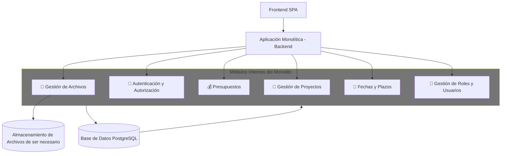

#  🧾Resumen caso ProManage  – Plataforma de gestión administrativa

**ProManage** es una plataforma de gestión administrativa diseñada para facilitar la planificación, organización y seguimiento de proyectos dentro de una organización. Con el objetivo de optimizar su desarrollo, la empresa ha conformado un equipo especializado en DevOps, encargado de diseñar una solución robusta, escalable y segura. La aplicación permitira registrar usuarios, crear proyectos, adjuntar archivos relevantes, asignar presupuestos y controlar fechas y roles de acceso, brindando así una herramienta integral para la gestión eficiente de proyectos.

## 🚀 Objetivos del Proyecto

- Simplificar la gestión de proyectos desde una única interfaz.
- Ofrecer control de acceso por roles.
- Almacenar archivos y documentos relacionados a cada proyecto.
- Notificar a los usuarios sobre eventos importantes.
- Facilitar la escalabilidad y el mantenimiento con buenas prácticas DevOps.

Esta plataforma permitirá a los usuarios:
## 🧩 Funcionalidades Principales

| Funcionalidad                               | Descripción                                                                 |
|--------------------------------------------|-----------------------------------------------------------------------------|
| 🔐 Registro y autenticación de usuarios     | Gestión de acceso con Supabase Auth.                                        |
| 📁 Gestión de proyectos                     | Permite crear, editar y visualizar proyectos.                               |
| 💰 Asignación de presupuestos               | Define y asigna presupuestos individualmente por proyecto.                  |
| 📎 Adjuntar archivos                        | Carga y vinculación de documentos relevantes vía Supabase Storage.          |
| 📆 Control de fechas y plazos               | Gestión de tiempos clave y fechas de entrega.                              |
| 👥 Roles y permisos                         | Configura distintos niveles de acceso para los usuarios.                    |
| ✉️ Notificaciones por correo                | Alertas automáticas enviadas vía Resend.                                    |

## 🧱 Arquitectura del Proyecto
| Componente                   | Descripción y Motivo de Uso                                             |
|------------------------------|-------------------------------------------------------------------------|
| **Arquitectura Monolítica** | Simplifica el desarrollo inicial, reduciendo complejidad técnica, con posibilidad de transición futura. |
| **Railway**            | Provee infraestructura como servicio (PaaS) con escalado automático y monitoreo eficiente. |
| **Supabase**           | Solución BaaS que desacopla autenticación, base de datos (PostgreSQL) y almacenamiento, acelerando el desarrollo. |
| **Resend**             | Permite el envío de notificaciones automáticas por correo de forma confiable y escalable. |
| **Docker**             | Garantiza portabilidad y consistencia en diferentes entornos gracias a la contenerización. |
| **Kubernetes (Opcional)** | Facilita la orquestación de contenedores en entornos complejos, ideal para escalar en fases avanzadas. |

---

## 📊 Arquitectura monolítica modular para ProManage
 

🧱 ¿Qué muestra el diagrama?
Es una arquitectura monolítica modular para ProManage, donde todo el backend está en una sola aplicación, pero dividido internamente en módulos.

🔹 Componentes principales
- Frontend SPA: Aplicación web que se comunica con el backend.
- Backend Monolítico: Una sola app que contiene todos los módulos:
- 📎 Gestión de Archivos
- 🔐 Autenticación y Autorización
- 💰 Presupuestos
- 📁 Gestión de Proyectos
- 📆 Fechas y Plazos
- 👥 Roles y Usuarios
- Base de Datos PostgreSQL: Compartida por todos los módulos.
- Almacenamiento en la nube: Usado solo por el módulo de archivos.

---

## 🧱 Arquitectura del Proyecto

| Componente                | Descripción                                                                 |
|--------------------------|-----------------------------------------------------------------------------|
| **Modelo Arquitectónico** | Arquitectura Monolítica                                                     |
| **Infraestructura (PaaS)**| [Railway](https://railway.app) — despliegue, escalado y monitoreo automático |
| **Contenerización**       | Docker — para empaquetar la aplicación                                      |
| **Orquestación**          | Kubernetes — opcional para entornos más avanzados                          |
| **Backend as a Service**  | Supabase — autenticación, base de datos (PostgreSQL) y almacenamiento       |
| **Notificaciones**        | Resend — envío de correos y alertas a usuarios                             |

---

## ⚙️ Tecnologías Utilizadas

| Categoría             | Tecnología               | Uso principal                                               |
|----------------------|--------------------------|-------------------------------------------------------------|
| **Infraestructura**  | Railway (PaaS)           | Despliegue y escalado automático                            |
|                      | Docker                   | Contenerización de la aplicación                            |
|                      | Kubernetes (opcional)    | Orquestación avanzada de contenedores                       |
| **Backend / BaaS**   | Supabase Auth            | Registro e inicio de sesión de usuarios                     |
|                      | Supabase PostgreSQL      | Base de datos relacional para entidades del sistema         |
|                      | Supabase Storage         | Gestión de archivos y documentos                            |
| **Notificaciones**   | Resend                   | Envío de correos electrónicos y alertas                     |
| **Control de código**| Git + GitHub             | Control de versiones y colaboración                         |

---

## 🌐 Escalabilidad y Mantenimiento

- Railway permite escalar automáticamente en función del tráfico y la carga.
- Se utiliza contenerización con Docker para portabilidad y consistencia entre entornos.
- Supabase desacopla funcionalidades críticas como autenticación y almacenamiento.
- La arquitectura monolítica permite simplicidad en fases iniciales, con opción a evolucionar.

---

